*********************************
Note taking with reStructuredText
*********************************
----------------------
``rst-note``  manual
----------------------

:Author: Jens Getreu
:Date: 2016-11-02
:Revision: 0.8.1

.. footer::
   Page ###Page###
.. contents::
.. section-numbering::

.. raw:: pdf

   PageBreak

This is the documentation of the ``bin/rst-note`` program. 

Markup languages like ``reStructuredText`` are perfectly suited for quick note
taking. Type your notes with your favourite editor, view and browse them
with ``Chromium``, ``Chrome`` or ``Firefox``.

All you need is the so called ``rst-note`` ash-script, the python packages
restview_, docutils_, pygments_ and any browser of your choice: Chromium, Chrome
or Firefox.

.. _pygments: https://pypi.python.org/pypi/pygments
.. _restview: https://pypi.python.org/pypi/restview
.. _docutils: https://pypi.python.org/pypi/docutils

``rst-note`` runs under Linux and Windows. [#]_ The script operates in
four modes depending on it’s options (see ):

:New note:
    Creates a new context depending *rst* note file.

:Edit notes:
    Launches an editor.

:View notes:
    Launches a live-previewer (Firefox, Chrome of Chromium).

:Sync filename:
    Renames the filename to be in sync with the document’s title.

The project is hosted on Github: restructuredtext-notetaking_.
The documentation is at http://getreu.net_. 
There you also find a `pdf rendition`_ of this document.

.. _restructuredtext-notetaking: https://github.com/getreu/restructuredtext-notetaking
.. _getreu.net: http://getreu.net/public/downloads/doc/restructuredtext-notetaking/
.. _pdf rendition: http://getreu.net/public/downloads/doc/restructuredtext-notetaking/README.pdf

**Quickstart:**

    1. Read the installation guide for Linux_ or Windows_.

    2. Read about the 2 most common use cases `How students take notes`_.

.. [#]
   MacOsX ships with the ``BSD sed`` tool which is not compatible with 
   ``GNU sed``. Workaround: run in ``rst-note`` in `busybox`.

.. raw:: pdf

   PageBreak

How students take notes
=======================

A fellow student still uses paper and pen. I ask her why and she replied
“I can better concentrate. My computer distracts me. I would do all kind of other
things, but not listening.”.

This is certainly true. As I am concerned, I am not good at logistics.
For me having all documents and notes in one little machine is a real
blessing.

To illustrate how to work with ``rst-note`` here are my most common
workflows.

The lesson starts
-----------------

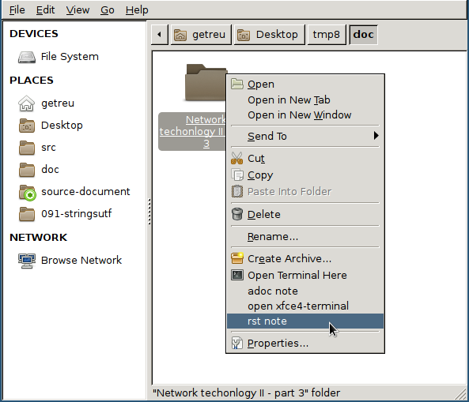

   Create a new note in the selected directory

Alternatively you can open the folder you want to create a new note in
and right-click on some empty white space. Both actions create a new
document as shown in the figure below.

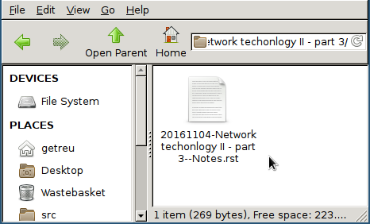

   Resulting new file

After creation of the new file ``rst-note`` opens an editor and the
``viewrest`` viewer.

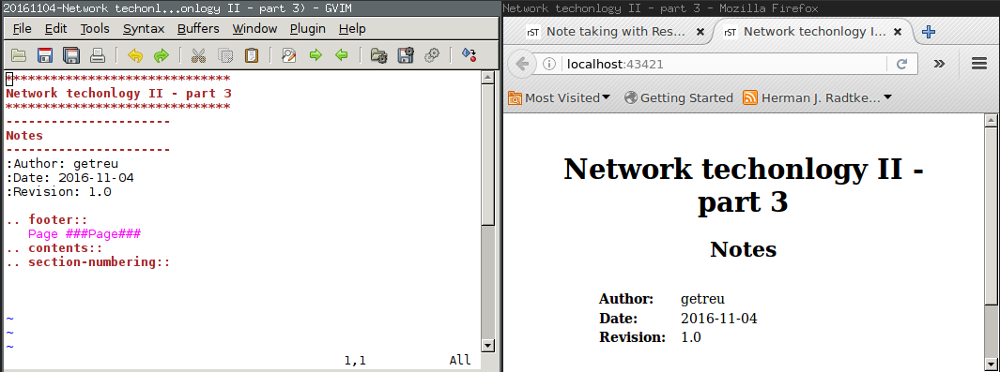

   Editor and ``viewrest`` viewer window opens automatically

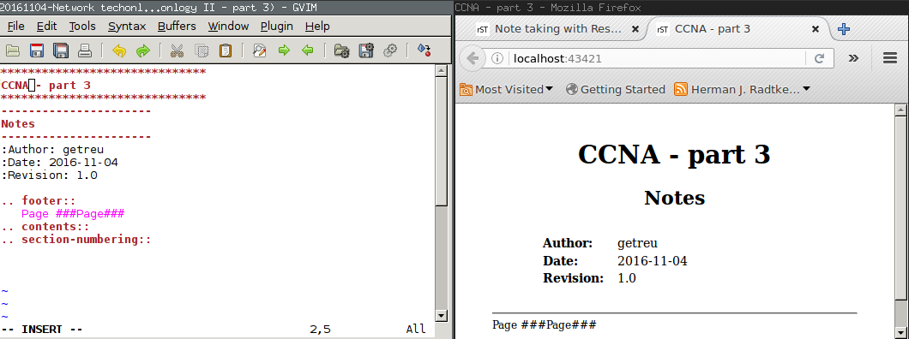

   Change document title

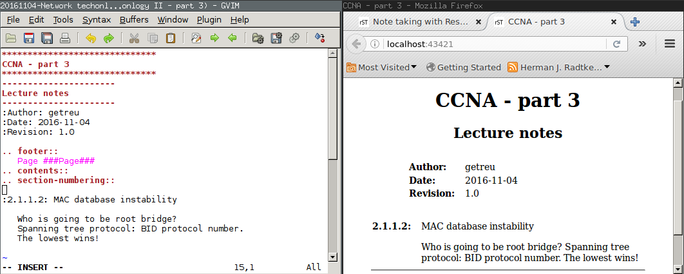

   Adding content

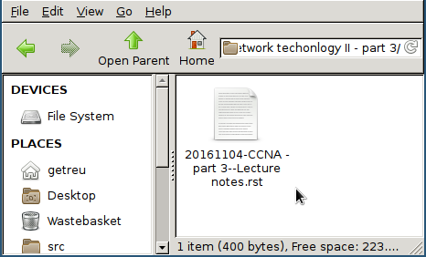

   ``rst-note`` synchronizes document title and filename when the editor closes

    **Note**

    Before and after launching the editor ``rst-note`` renames the file
    to be in sync with the reStructuredText title. For more details see
    `Title filename sync`_.

Taking notes on an existing file
--------------------------------

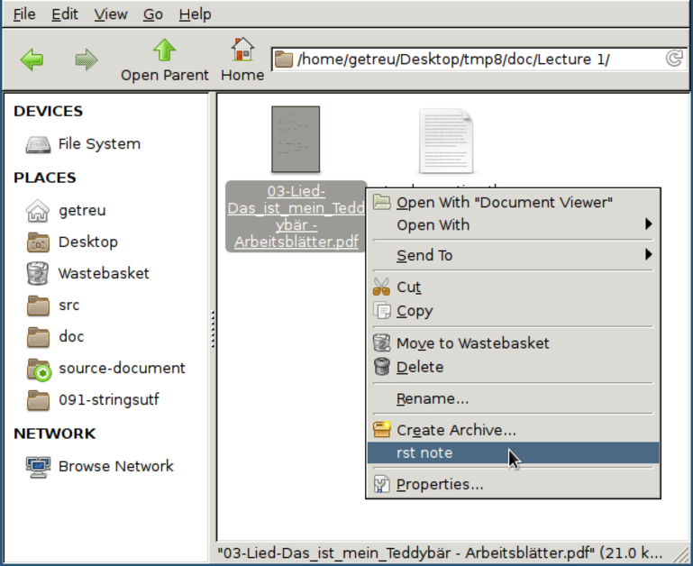

   Launching ``rst-note`` with the selected filename as parameter

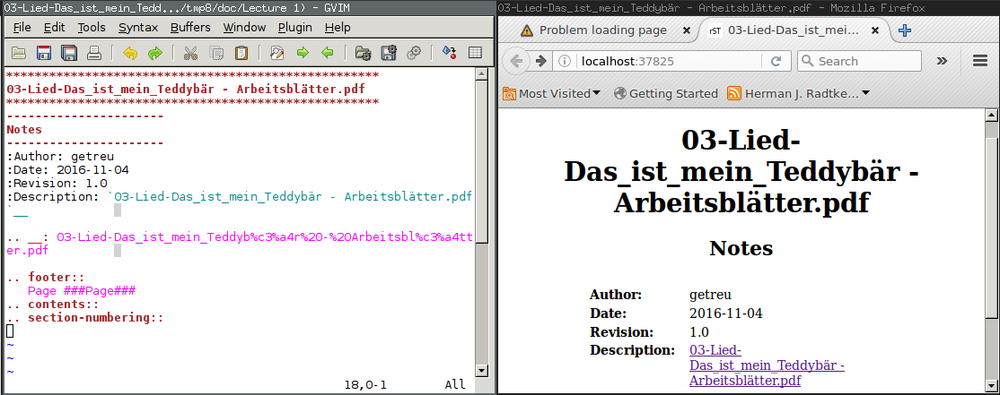

   ``rst-note`` creates a new document and opens the editor and viewer

The above figure shows the metadata ``rst-note`` has inserted automatically.

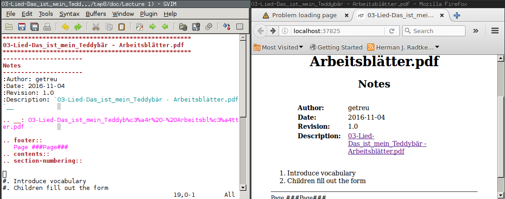

   Adding some content

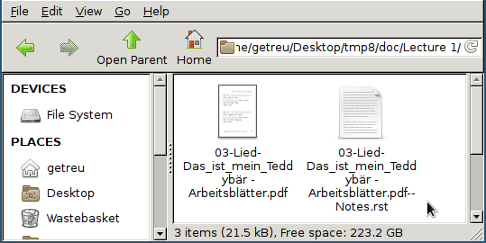

   The new file with annotations

.. raw:: pdf

   PageBreak

Create a new note
=================

There are several ways to launch ``rst-note``.

Linux
    -  Launch the commands in shell as described the sections *Syntax*
       below.

    -  Right click on a file or directory in your file-manger and choose
       *rst-note* in the context menu. See `Linux file manager configuration`_.

Windows
    -  Drag and drop a file or directory on the shortcut
       ``rst-note.bat`` on your desktop.

       This method also works in very restricted environments. The only
       rights you need is to be allowed to execute portable binaries and
       batch scripts.

    -  Double-click the shortcut ``rst-note.bat`` on your desktop. This
       will place a new note on your desktop.

    -  Right click on a file or directory in file explorer and choose *rst-note*
       in the context menu. See `Windows file explorer configuration`_.

Invoking the script
-------------------

.. code:: bash

     rst-note -h

shows a short help text with available command line options:

::

    /usr/local/bin/rst-note creates, edits or views an reStructuredText note.

    usage:

       /usr/local/bin/rst-note [-h][-ro|-so|-eo] | [<File.rst>|<Dir>|<File>]

    <Dir>|<File>: directory where the new note file will be created
    (current directory if none).
    If <File> is given a new rst note will be created next to that file.
    If <File.rst> is given the file is edited.
    Filename of <File> is changed when not in sync with title.

    Options:
    -ro     Do not open editor, open viewer only.
    -eo     Do not open viewer, only new note or, sync filename and edit.
    -so     Do not open editor or viewer, only new note or sync filename.

.. table:: Mapping  ``rst-note`` options to functions

   +----------------+----------------+----------------+----------------+----------------+
   | Option         | Create a new   | Launch editor  | Launch viewer  | Sync           |
   |                | note           |                |                | title-filename |
   +================+================+================+================+================+
   | *without*      | Y \*           | Y              | Y              | Y              |
   +----------------+----------------+----------------+----------------+----------------+
   | ``-ro``        | Y \*           | N              | Y              | N              |
   +----------------+----------------+----------------+----------------+----------------+
   | ``-eo``        | Y \*           | Y              | N              | Y              |
   +----------------+----------------+----------------+----------------+----------------+
   | ``-so``        | Y \*           | N              | N              | Y              |
   +----------------+----------------+----------------+----------------+----------------+

.. table:: Legend

   +--------+-----------------------+
   | Symbol | Meaning               |
   +========+=======================+
   | Y      | is included           |
   +--------+-----------------------+
   | N      | not included          |
   +--------+-----------------------+
   | Y\*    | If a note with the    |
   |        | same filename exists  |
   |        | on disk already, no   |
   |        | new note is created.  |
   |        |                       |
   |        |                       |
   |        |                       |
   |        |                       |
   +--------+-----------------------+

Directory as parameter
----------------------

Syntax 1
~~~~~~~~~~~

.. code:: bash

     rst-note <path>/<dir>

creates the following document [#]_:

::

    <path>/<dir>/YYYYMMDD-<dir>--Notes.rst

.. code:: rst

   *****
   <dir>
   *****
   -----
   Notes
   -----
   :Author: $USER
   :Date: YYYY-MM-DD
   :Revision: 1.0

.. [#] The template is slightly simplyfied.  

Example 1
~~~~~~~~~~~

.. code:: bash

     rst-note 'doc/Lecture 1'

creates the following document:

::

    doc/Lecture 1/20161102-Lecture 1--Notes.rst

.. code:: rst

   *********
   Lecture 1
   *********
   -----
   Notes
   -----
   :Author: getreu
   :Date: 2016-11-02
   :Revision: 1.0

No parameter
------------

Syntax 2
~~~~~~~~~

It is also possible to invoke the script without options:

.. code:: bash

     rst-note

The result is the same as above but the current working directory 
defines  ``<path>/<dir>``.

Example 2
~~~~~~~~~

.. code:: bash

     cd 'doc/Lecture 1'
     rst-new-note

creates the following document:

::

    doc/Lecture 1/20161102-Lecture 1--Notes.rst

.. code:: rst

   *********
   Lecture 1
   *********
   -----
   Notes
   -----
   :Author: getreu
   :Date: 2016-11-02
   :Revision: 1.0

Filename as parameter
---------------------

The filename should be some existing local file you want to annotate.
For example I use this feature to note from where I have downloaded a
.pdf.

Syntax 3
~~~~~~~~

When invoke with a filename, no date stamp is prepended.

.. code:: bash

     rst-note <path>/<dir>/<filename>

The new file will look like this:

::

    <path>/<dir>/<filename>--Notes.rst

.. code:: rst

   **********
   <filename>
   **********
   -----
   Notes
   -----
   :Author: <$USER>
   :Date: 2016-11-03
   :Revision: 1.0
   :Description: `<filename>`__

   .. __: <url-encoding(filename)>

Example 3
~~~~~~~~~

.. code:: bash

     rst-new-note 'doc/Implementing the NIST Cybersecurity Framework.pdf'

creates the following document:

::

    doc/Implementing the NIST Cybersecurity Framework.pdf--Notes.rst

.. code:: reStructuredText

   *************************************************
   Implementing the NIST Cybersecurity Framework.pdf
   *************************************************
   -----
   Notes
   -----
   :Author: getreu
   :Date: 2016-11-03
   :Revision: 1.0
   :Description: `Implementing the NIST Cybersecurity Framework.pdf`__

   .. __: Implementing%20the%20NIST%20Cybersecurity%20Framework.pdf

Before quitting the ``rst-note`` script executes it's *editing-mode*.
This opens in your editor the completed template (see example above) and
a live-previewer showing the rendered *rst* file:

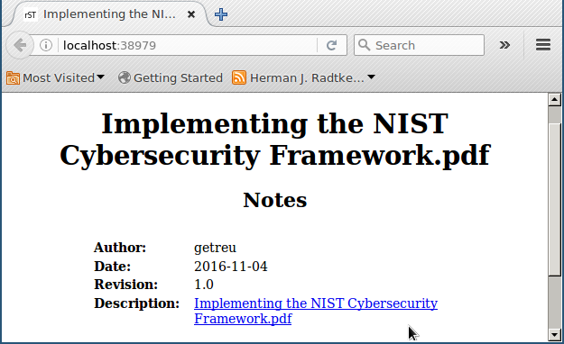

.. raw:: pdf

   PageBreak

Editing notes
=============

Syntax 4
--------

.. code:: bash

      rst-note <path>/<filename>.rst

launches the ``gvim`` editor by default. Replace ``gvim`` by any
editor of your choice. At the same time a ``chrome`` or ``chromium``
window will pop up showing the live rendition of your *rst* file. You
need to have the restview_ installed on your system. 
You may want to use some autosave editor feature in order to observe
changes immediately in the rendered preview live.

.. restview: https://pypi.python.org/pypi/restview

At the beginning and the end of the ``rst-note`` script another helper function
``ChangeFilename`` is called. It guarantees that any change in the *rst*
document title will replicate in the filename of that *rst* file. This
guarantees that the filenames of *rst* notes always correspond to their *rst*
document title allowing you to find your notes quickly in your directory
structure. See `Title filename sync`_ for more details.

    **Note**

    You can disable the title-filename-sync feature by adding a blank
    line at the beginning of the *rst* document.

Example 4
---------

.. code:: bash

      rst-note 'Implementing the NIST Cybersecurity Framework.pdf--Notes.rst'

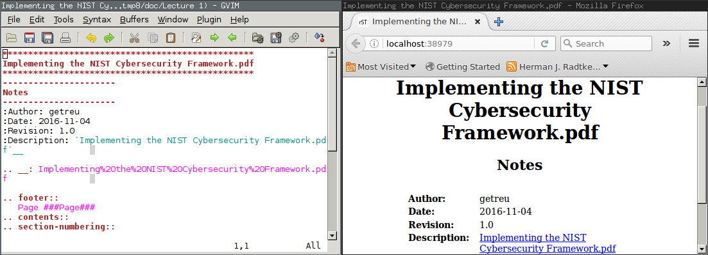

The same result is obtained by repeating the same command you used to
create this note  [2]_:

.. code:: bash

      rst-note 'Implementing the NIST Cybersecurity Framework.pdf'

.. [2]
   This only works if you have not changed the original title in the
   meantime!

Viewing notes
=============

Syntax 5
--------

.. code:: bash

      rst-note -ro <path>/<filename>.rst

launches restview_ which opens a live-rendition of the current document in
your default browser. 

Example 5
---------

.. code:: bash

      rst-note -ro 'Implementing the NIST Cybersecurity Framework.pdf--Notes.rst'

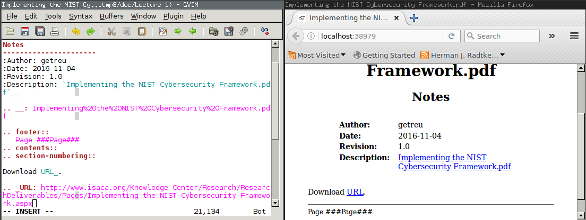

All text in the above example was automatically generated by the
``rst-new-note`` script only the last link *Download URL* was added “by
hand”. This is particularly useful for a short note about the source
of a downloaded document.

.. raw:: pdf

   PageBreak

Title filename sync
===================

Consider the following note file:

::

    20151208-Make this world a better place--Suggestions.rst

The filename has 3 parts:

::

    <order mark>-<simplified-title>--<simplified-subtitle>.rst

A ``<order mark>`` can be a

-  *chronological order mark* or

   ::

       20140211-
       20151208-

-  *a sequence number order mark*.

   ::

       02-
       08-
       09_02-

``<order mark>`` can be any combination of ``0123456789-_``.

When ``rst-note`` creates a new note based on a directory, it prepends a
*chronological order mark* of today. The ``<simplified-title>`` part is
derived from the parent directory name omitting its own *order mark*.

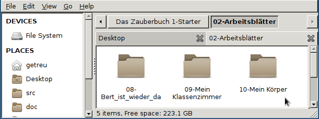

   Sequence number order mark

The shell command

.. code:: bash

      rst-note '10-Mein Körper'

will result in a new file:

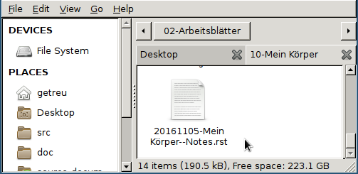

   File: ``10-Mein Körper/20161105-Mein Körper--Notes.rst``

   **Note**

   The parent directory’s order mark is never used to compose a
   filename for a new note.

When ``rst-note`` creates a new note based on a filename no *order mark*
is prepended.

Before and after editing the ``rst-note`` analyses the title and
subtitle of the *rst* file and simplifies them in a file-system
friendly form. If the result does not equal to
``<simplified-title>--<simplified-subtitle>`` the filename is changed on
disk. Potential *order marks* remain untouched.

    **Note**

    You can disable this feature by inserting a blank line at the
    beginning of the *rst* file.

    **Important**

    ``rst-note`` might change the note’s filename but never changes an
    *order mark*!

For details about the
``<simplified-title>--<simplified-subtitle>`` string refer to the
``SanitizeFilename()`` function in ``bin/rst-note``.

.. raw:: pdf

   PageBreak

Installation and configuration
==============================

``rst-note`` runs on Linux and Windows. For Windows installation and
configuration see section Windows_ below.

Linux
-----

#. Install the rst-live-previewer restview_.

#. Download the note-taking-script ``bin/rst-note`` from Github 
   `getreu/restructuredtext-notetaking`_
   
   .. _`getreu/restructuredtext-notetaking`:
    <https://github.com/getreu/restructuredtext-notetaking>

#. Copy it in a location of your ``$PATH`` and make it executable for
   everyone.

   .. code:: bash

         sudo cp rst-note /usr/local/bin
         sudo chmod a+rx /usr/local/bin/rst-note

#. Install some helper packages (most should be already on your system).

   .. code:: bash

         sudo apt-get install dirname basename sed vim-gtk

   Replace ``vim-gtk`` with an editor of your choice. Configure
   ``rst-note`` accordingly.

#. Configuration: At the beginning of ``rst-note`` you will find a
   section enclosed in the comments ``CONFIGURATION SECTION START`` and
   ``CONFIGURATION SECTION END``.

       **Note**

       The only file you edit to change the default choices for *editor*
       and *viewer* under Linux is ``rst-note``. **Not**
       ``rst-note.bak``!

   Here you can specify what editor you want to use.
   Make sure that your editor does
   not fork when launched. If it does fork, the script will still work
   but when you quit, no *rst*-title-filename sync will occur.
   Outside the ``CONFIGURATION SECTION`` no changes should be necessary.

       **Warning**

       The environment variables ``ADOC_EDITOR`` or ``ADOC_VIEWER``
       -when defined- have precedence over settings in the
       ``CONFIGURATION SECTION`` and will override them.

#. Test the installation: open a console window and type ``rst-note``.
   An *editor* and *viewer* window containing a note template should
   open.

#. Optional: integrate the scripts with your file-manager (see 
   `Integration with file manager`_).

Windows
-------

#. Install the rst-live-previewer restview_.

#. Download the files ``bin/rst-note``, ``bin/rst-note.bat`` and
   ``bin/busybox.exe`` from Github
   `getreu/restructuredtext-notetaking`_
   
#. The version of ``busybox`` in the above repository is
   probably outdated. Please get a newer version from here:
   http://frippery.org/busybox/
 
#. Copy the 3 files in a directory of your choice (hereafter referred to as
   *BIN\_DIR*).

#. Configuration:

   At the beginning of ``rst-note.bak`` you will find a section enclosed
   in the comments ``CONFIGURATION SECTION START`` and
   ``CONFIGURATION SECTION END``.

       **Note**

       The only file you edit to change the default choices for *editor*
       and *viewer* under Windows is ``rst-note.bat``. **Not**
       ``rst-note``!

       **Important**

       New notes are created with an Unicode BOM indicating Unicode
       encoding. Do not use the ``notepad`` editor as it does not
       understand Unicode. Use ``Wordpad`` or any modern Unicode
       editor instead.

   Here you can specify the path to the restview_-program. Next configure
   the path to your editor of your
   choice. Make sure that your editor does not fork when launched. If it
   does fork, the script will still work but when you quit, no
   *rst*-title-filename sync will occur. Outside the
   ``CONFIGURATION SECTION`` no changes should be necessary.

#. Create a shortcut to ``rst-note.bat`` on your desktop, click on
   properties and change the shortcut to *run minimized*. Let the *start
   in* path empty.

   .. figure:: images/shortcut-properties.png
      :width: 70%
      
      Shortcut properties

#. Test the installation: drag a file or directory on the
   ``rst-note Shortcut`` on your desktop. An *editor* and *viewer*
   window should open.

#. Optional: integrate the scripts with your file-manager (see 
   `Integration with file manager`_).

Integration with file manager
-----------------------------

``rst-note`` integrates nicely with your favorite `Linux file manager`_
or `Windows Explorer`_.

.. _`Linux file manager`: `Linux file manager configuration`_
.. _`Windows Explorer`: `Windows file explorer configuration`_

Linux file manager configuration
~~~~~~~~~~~~~~~~~~~~~~~~~~~~~~~~

The example below shows the *Thunar* filebrowser’s custom actions.

Most file-manager allow extending the context menu. As an example the
following images show the configuration of the Thunar-file-manger.

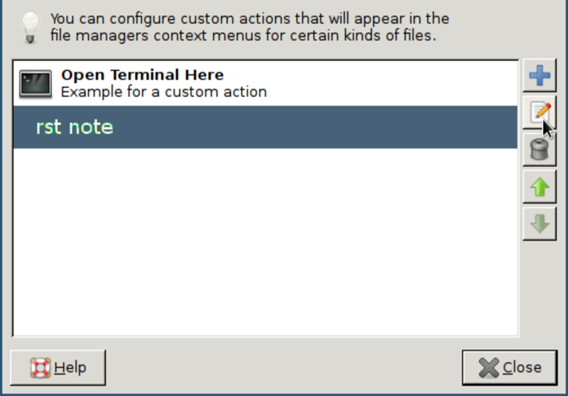

   *Thunar* filebrowser’s custom actions

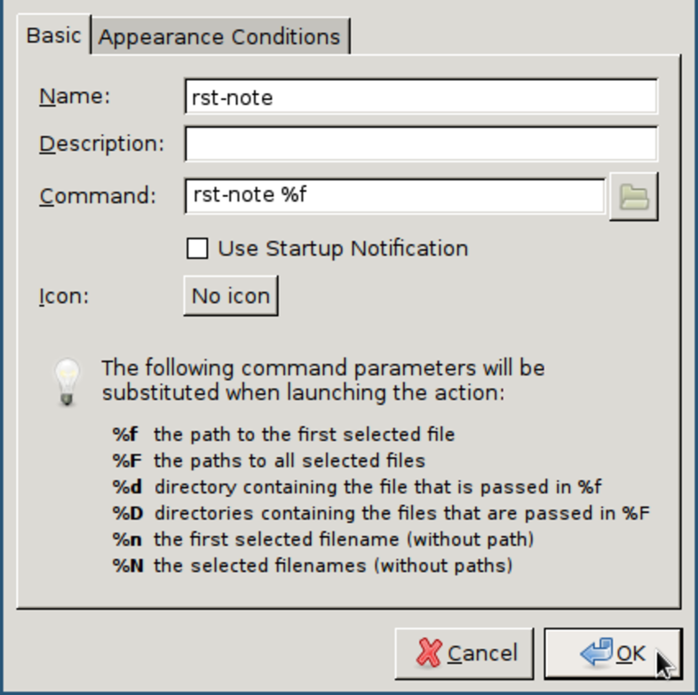

   Edit custom action

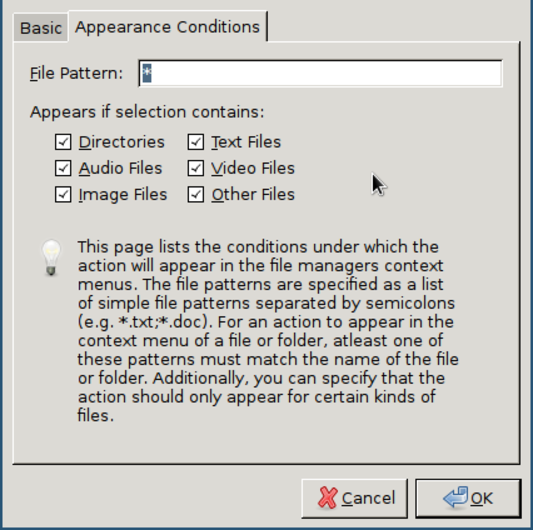

   Appearance condition

Windows file explorer configuration
~~~~~~~~~~~~~~~~~~~~~~~~~~~~~~~~~~~

1. Open a folder containing an ``.rst`` file.

2. Right-click the ``.rst`` file and point to *Open with* and then click
   *Choose default program*.

   .. figure:: images/explorer1.png
      :width: 100%

      Choose default program

3. Select the *Always use the selected program* and then click
   *Browse…​*.

   .. figure:: images/explorer2.png
      :width: 80%

      Click on *Browse...*

4. Click *Browse…​* then browse to your *BIN\_DIR* directory, select
   ``rst-note.bak`` and click *Open* and later *Ok*.

   .. figure:: images/explorer3.png
      :width: 100%

      Select ``rst-note``.

:Further reading:

   -  `Change the program that opens a type of file <http://windows.microsoft.com/en-us/windows/change-file-open-program#1TC=windows-7>`__

   -  `How to Add Any Application Shortcut to Windows Explorer’s Context Menu <http://www.howtogeek.com/107965/how-to-add-any-application-shortcut-to-windows-explorers-context-menu/>`__.

